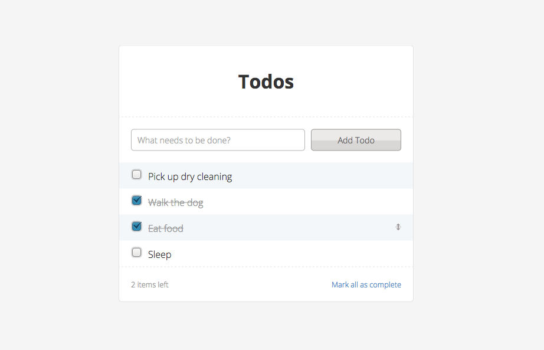

# Todo!



This is a simple todo app in Flask and React. It features a orderable todo list
with a SQLite database attached to it.

## Setup

Make sure you have Python installed. Run the following commands in your
favourite terminal to install depenencies and get started.

```shell
pip install Flask
python setup.py
bower install
```

This will install Flask (if it isn't installed allready), install our databse
and then install the needed front-end depenencies.

### Running

The app is started by running `python app.py` in your favourite terminal.

## Structure

### Endpoints

The backend is fairly monolithic, with these endpoints:

* `GET /todos.json` – fetch all todos
* `POST /todos.json` – create new todo, send todo content as `title`
* `POST /todos/complete_all.json` – mark all todos as completed
* `POST /todos/<int:todo_id>/status.json` – change status of the todo with the id `todo_id`, send todo status as `completed`
* `POST /todos/set_order.json` – set order of the todos, recieves json array name `order`: `[{id: <todo_id>, order: <the todos position, int>},...]`

### Frontend

The React classes are structured like this:

```
- TodoApp
  - TodoForm
  - TodoList
    - [Todo,Todo,Todo,...]
```

## Todo

You're laughing right now, I understand that.

When there is time, this should be done:

* Clean up [`todo_app.js`](static/javascript/todo_app.js) and all it's ugly ajax calls
* Move database helpers in [`app.py`](app.py) to separate file
* Improve the semi-scetchy draggable function, so that it can be updated instantly etc
* Align checkbox better
